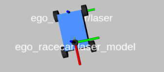
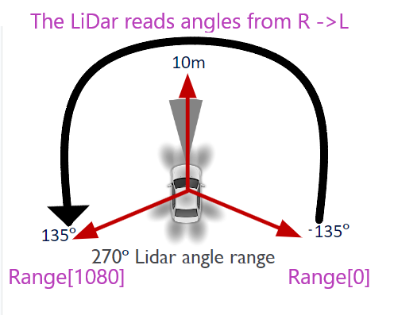

# Lab 2: Rigid Body Transforms

## Learning Goals

- Understanding Rigid Body Transformations in the simulation environment

## Before you start

Students should have the simulator launched and keyboard teleop commands running. Refer to Lab 1 [Section 3.2](https://github.com/unlv-f1/lab1?tab=readme-ov-file#3-launching-the-simulator) for instructions.  

## 1. Transforms

Rviz gives students the ability to visualize topics that are being published or subscribed to. This includes
transforms. Within rviz2, students can add and create visualization by type or topic. To do this, find the **Add**
button on the bottom left of the rviz **Displays** panel. For this lab, students may add *by display type* the transform hierarchy, **TF**. The side panel **Displays** will now include **TF**, which will include all transform frames of the vehicle.


**TF** also allows visualization of the **Tree**, which grants insight into the transform hierarchy- which topics
are being transformed from which topics. To observe how the transform frames are operating in real
time, students can drive the vehicle around using the keyboard controls. Make sure to run the
command in a separate terminal.

## TF2-Tools
There are ros2 dependencies that can help to make the information shown within rviz2 more digestible.
For this, students will install dependencies using:
```bash
user@f1sim:~$ sudo apt-get install ros-foxy-tf2-tools ros-foxy-tf-transformations
```

With the simulator running, students can run the following command to visualize a transform hierarchy
tree:
```bash
user@f1sim:~$ ros2 run tf2_tools view_frames.py
```

The tree will then be available within the directory the command was run as frames.pdf along with
information about the transforms.
Students may also retrieve the transforms between any two frames using the following command:

```bash
user@f1sim:~$ ros2 run tf2_ros tf2_echo [source_frame] [target_frame]
At time 1622031731.625364060
- Translation: [2.796, 1.039, 0.000] #in meters
- Rotation: in Quaternion [0.000, 0.000, 0.202, 0.979]
At time 1622031732.614745114
- Translation: [1.608, 0.250, 0.000]
- Rotation: in Quaternion [0.000, 0.000, 0.032, 0.999]
```

The translation from the above output will be in the form [x,y,z], while the quaternion for rotation is
[x,y,z,w]. (*Note: A rotation matrix of [0,0,0,1] typically means there is no rotation.*)

## **Laser_Scan** for Vehicle Model
The best way for the vehicle to assess its current distance from the nearest wall is to access the vehicle’s
**Laser_Scan** data. However, there is currently no transform that accurately delivers our measurement
information.



As pictured above, there are two transform frames for the laser: *ego_racecar/laser* and
*ego_racecar/laser_model*. The information from our **Laser_Scan** topic gives us the measurements from
the wall to the laser, when in reality, this is not on model for the vehicle. Students will need to parse
the data from the **Laser_Scan** and transform the information so that it is correct for the given *laser_model*
position.
Students will need to take the measurements from 0 for each starting position. (*Tip: Students can parse this information from the commandline using:* ``` ros2 topic echo /scan -l [LaserIndex]```)

## Understanding **Laser_Scan** Readings

Documentation on the Laser_Scan can be found under the Resources section below. **Note: This format is available
through lookup for *any* topic. Just search the name of the topic, followed by "documentation" in any search
engine.** 

Below is an image to help visualize the information the documentation provides.




## Vehicle Position

To answer the questions posed on Canvas, students will need to change the starting position of the vehicle
within the simulator multiple times, and provide the results for each change. Access the file located within
/sim_ws/src/f1tenth_gym_ros/config/sim.yaml. Locate and change the values within the ego vehicle’s
starting pose to the following:
1. X : 10, Y : 0
2. X : −10, Y : 9, θ : 10

**Rebuild the workspace after making any changes to the *.yaml* file and relaunch the gym. The vehicle
should have changed its starting position in simulator.**


## Deliverables and Submission
Students will maintain a private github repository, cloning this repo and
sharing collaboration rights with the TA. In addition to the three
deliverables described in this document, fill in the answers to the
questions listed in **`SUBMISSION.md`**. 

Students will add the TA to their labs as a collaborator. The TA's
gitHub: [https://github.com/Breanna-Geller]. 


## Grading Rubric

- SUBMISSION.md Responses: **100** Points


## Resources

- [Adding Collaborator to GitHub](https://docs.github.com/en/account-and-profile/setting-up-and-managing-your-personal-account-on-github/managing-access-to-your-personal-repositories/inviting-collaborators-to-a-personal-repository)

- [**Laser_Scan** Documentation](https://docs.ros.org/en/noetic/api/sensor_msgs/html/msg/LaserScan.html)