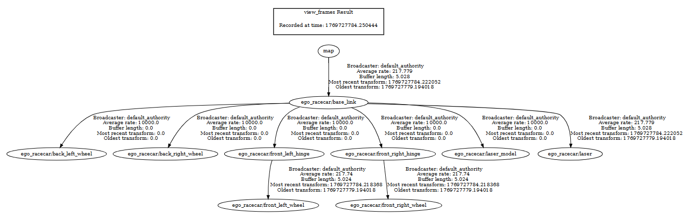
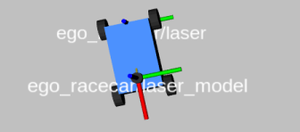
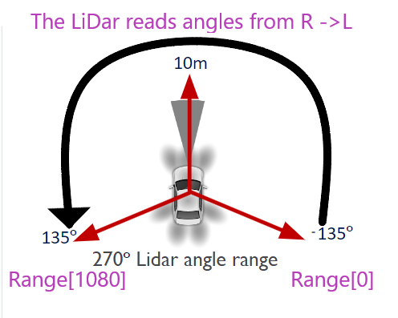

# Lab 2: Rigid Body Transforms

## Learning Goals

* Understand how to apply Rigid Body transformations in ROS 2.
* Understand how to use ROS 2 TF2 tools for monitoring transform data.
* Understand how to programmatically use the ROS 2 TF2 API.

## Lab Setup

We will build off of the local file structure given in the first lab.

```
${HOME}
  |
  +-- lab1_ws/              -- Lab 1 Workspace folder (ALWAYS BUILD HERE!)
  |     |
  |     +-- build/          -- Generated by `colcon build`
  |     |
  |     +-- log/            -- Generated by `colcon build`
  |     |
  |     +-- install/        -- Generated by `colcon build`
  |     |
  |     +-- src/            -- Source folder
  |          |
  |          +-- lab1_ws/   -- Lab 1 Package
  |
  +-- lab2_ws/              -- Lab 2 Workspace folder (ALWAYS BUILD HERE!)
  |     |
  |     :
  |     |
  |     +-- src/            -- Source folder
  |          |
  |          +-- lab2_ws/   -- Lab 2 Package
  |
  +-- sim_ws/
        |
        :
        |
        +-- src/
             |
             +-- f1tenth_gym_ros/
```

> **Note on different directories**: You may choose a different directory to use for `${HOME}` for your
> setup. But these commands will assume you are using `${HOME}` for your setup.

> **Note on `~`**: Keep in mind that `~` is always replaced with your home directory, so
> `${HOME}/some_dir` and `~/some_dir` are equivalent.

To start with the lab, clone the repository:

```
cd ~
git clone https://github.com/unlv-f1/lab2 lab2_ws
```

Then, mount `~/lab2_ws` onto your Docker container, as you've done for Lab 1.
You can do this either by using or using volume mounts.

* [Link to lab 1 bind mount commands][lab1-bind-mounts]
* [Link to TA's instructions on using volume mounts][ta-volume-mounts]

[lab1-bind-mounts]: https://github.com/unlv-f1/lab1?tab=readme-ov-file#4-creating-a-workspace-and-bind-mounting-it-into-the-docker-container
[ta-volume-mounts]: https://github.com/ederic-oytas/unlv-f1tenth-vscode-integration?tab=readme-ov-file#2-adding-a-new-volume-mount

## Part 1: Using TF2 Tools

### Simulator setup

This section is a review the commands for starting the simulator and keyboard
controller in Lab 1.

Start your Docker container. Then, start a new terminal. First, change your
current directory to `/sim_ws` using:

```bash
cd /sim_ws
```

Set up your terminal environment by sourcing the ROS 2 underlay and `/sim_ws`
overlay:

```bash
source /opt/ros/foxy/setup.bash          # source underlay
source /sim_ws/install/local_setup.bash  # source /sim_ws overlay
```

Then, you can run the RViz simulator using:

```bash
ros2 launch f1tenth_gym_ros gym_bridge_launch.py
```

After this, in a new terminal, run the following:

```bash
cd /sim_ws
source /opt/ros/foxy/setup.bash          # source underlay
ros2 launch teleop_twist_keyboard teleop_twist_keyboard
```

Have these two terminals up and running as you do the next lab.

If you need further reference, refer to Lab 1 [Section 3.2](https://github.com/unlv-f1/lab1?tab=readme-ov-file#3-launching-the-simulator) for instructions.  

### 1. Transforms

RViz provides a way to visualize topics as they are being published to. This
includes data such as:

* Odometry data
* Laser scan data
* Transform data
* Markers

Let's add a new visualization. To do this, click the **Add** at the bottom left
corner of RViz. This will bring up a popup for selecting a visualization to add.
Ensure that the **By display type** tab is selected and scroll down to **TF**
and click it. Then, click the **OK** button.


The side panel **Displays** will now include **TF**. This allows visualization
of the **Transform Tree**, which shows the hierarchy of transformation frames.
To observe how the transform frames are changing in real time, drive around the
car using `teleop_twist_keyboard`.

### TF2 Tools

Let's try to generate a diagram for our transform tree. **Do not close your**
**`f1tenth_gym_ros` and your `teleop_twist_keyboard` commands.** First, start
a new terminal and run the following:

```bash
cd /sim_ws                       # be in /sim_ws folder
source /opt/ros/foxy/setup.bash  # source underlay
```

Run the following command to generate a diagram of the transform tree:

```
ros2 run tf2_tools view_frames.py
```

If you use `ls`, you should see two new files in your current directory, named
`frames.pdf` and `frames.gv`.

If you open `frames.pdf` with a PDF viewer, you should see the following:



>
> **Opening `frames.pdf`**
>
> For those who have integrated VS Code into your environment, you may use
> VS Code to open `frames.pdf`:
>
> ```bash
> code frames.pdf
> ```
>
> Otherwise, one way to view the PDF is to move it to a mounted folder, then
> outside the container, read it locally with a PDF viewer (e.g. Firefox PDF
> viewer, Google Chrome PDF viewer).
> 


With the simulator running, students can run the following command to visualize a transform hierarchy
tree:
```bash
user@f1sim:~$ ros2 run tf2_tools view_frames.py
```

The tree will then be available within the directory the command was run as frames.pdf along with
information about the transforms.
Students may also retrieve the transforms between any two frames using the following command:

```bash
user@f1sim:~$ ros2 run tf2_ros tf2_echo [source_frame] [target_frame]
At time 1622031731.625364060
- Translation: [2.796, 1.039, 0.000] #in meters
- Rotation: in Quaternion [0.000, 0.000, 0.202, 0.979]
At time 1622031732.614745114
- Translation: [1.608, 0.250, 0.000]
- Rotation: in Quaternion [0.000, 0.000, 0.032, 0.999]
```

The translation from the above output will be in the form [x,y,z], while the quaternion for rotation is
[x,y,z,w]. (*Note: A rotation matrix of [0,0,0,1] means there is no rotation.*)

### **LaserScan** for Vehicle Model
The best way for the vehicle to assess its current distance from the nearest wall is to access the vehicle’s
**LaserScan** data. However, there is currently no transform that accurately delivers our measurement
information.



As pictured above, there are two transform frames for the laser: *ego_racecar/laser* and
*ego_racecar/laser_model*. The information from our **LaserScan** topic gives us the measurements from
the wall to the laser, when in reality, this is not on model for the vehicle. Students will need to parse
the data from the **LaserScan** and transform the information so that it is correct for the given *laser_model*
position.
Students will need to take the measurements from 0 for each starting position. (*Tip: Students can parse this information from the commandline using:* ``` ros2 topic echo /scan -l [LaserIndex]```)

### Understanding **LaserScan** Readings

Documentation on the Laser_Scan can be found under the Resources section below. **Note: This format is available
through lookup for *any* topic. Just search the name of the topic, followed by "documentation" in any search
engine.** 

Below is an image to help visualize the information the documentation provides.




### Vehicle Position

To answer the questions posed on Canvas, students will need to change the starting position of the vehicle
within the simulator multiple times, and provide the results for each change. Access the file located within
/sim_ws/src/f1tenth_gym_ros/config/sim.yaml. Locate and change the values within the ego vehicle’s
starting pose to the following:
1. X : 10, Y : 0
2. X : −10, Y : 9, θ : 10

**Rebuild the workspace after making any changes to the *.yaml* file and relaunch the gym. The vehicle
should have changed its starting position in simulator.**

## Part 2: Using ROS 2 TF2 Programmatically

TODO: Finish this section

## Deliverables and Submission
Students will maintain a private github repository, cloning this repo and
sharing collaboration rights with the TA. Fill in the answers to the
questions listed in **`SUBMISSION.md`**. 

Students will add the TA to their labs as a collaborator.

## Grading Rubric

- SUBMISSION.md Responses: **100** Points

## Resources

- [Adding Collaborator to GitHub](https://docs.github.com/en/account-and-profile/setting-up-and-managing-your-personal-account-on-github/managing-access-to-your-personal-repositories/inviting-collaborators-to-a-personal-repository)

- [**LaserScan** Documentation](https://docs.ros.org/en/noetic/api/sensor_msgs/html/msg/LaserScan.html)
